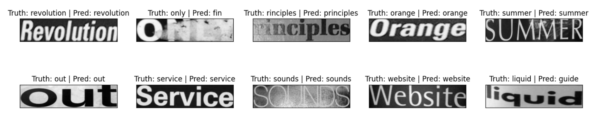

# Scene_Text_Dectection

## Giới thiệu
Đây là bài toán nhận diện văn bản trong ảnh, bài toán này có thể chia thành 2 bài toán con:
- Nhận diện vùng chứa văn bản (Text Detection)
- Nhận diện văn bản trong vùng chứa văn bản (Text Recognition)

## Text Detection
Sử dụng model yolov8 để detect vùng chứa văn bản trong ảnh.

## Text Recognition
Sử dụng model CRNN dựa trên Resnet101 để nhận diện văn bản trong vùng chứa văn bản.

## Hạn chế
- Các từ dự đoán thường bị lặp lại, việc này trong project tôi đã sử dụng thư viện SpellChecker để hạn chế được một phần.
- Chưa thiết kế thành một ứng dụng hoàn chỉnh, chỉ là một demo, pineline của project và các kết quả hiện có nằm trong file Pineline.ipynb. Sẽ cố gắng hoàn thiện thành 1 desktop app hoặc 1 basic website. Dưới đây là 1 số kết quả demo

